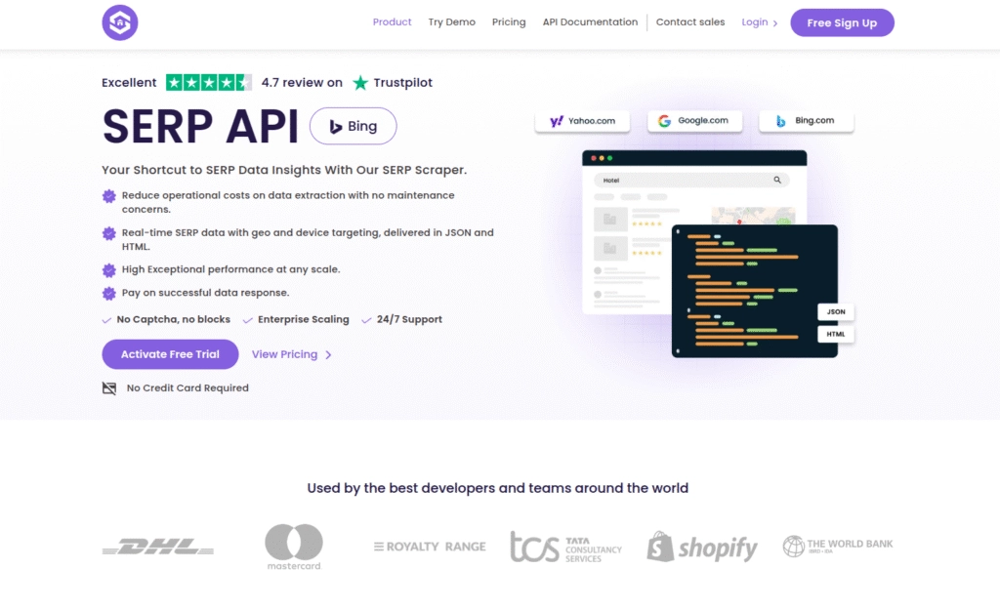
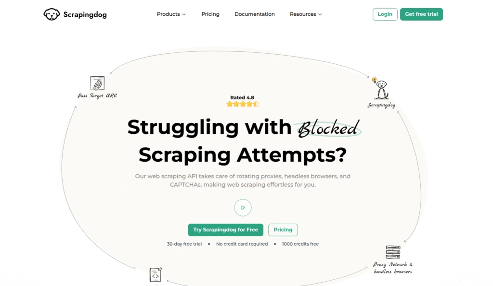
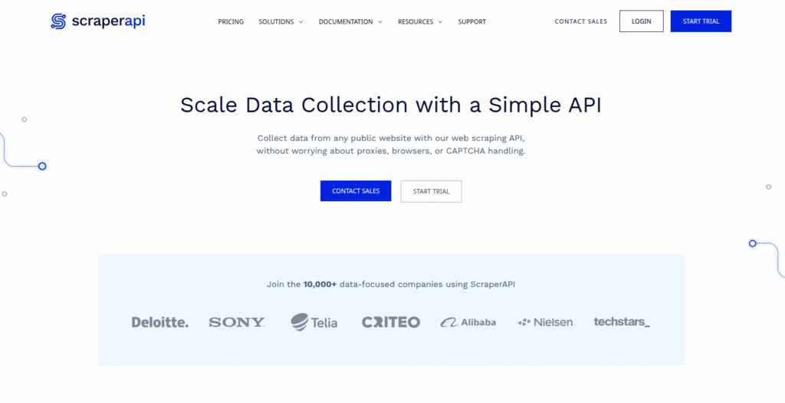
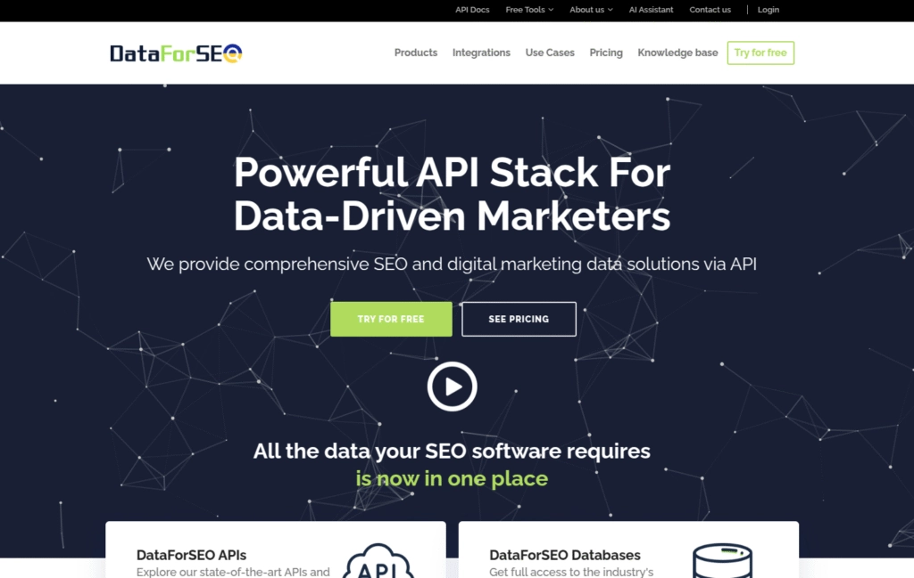
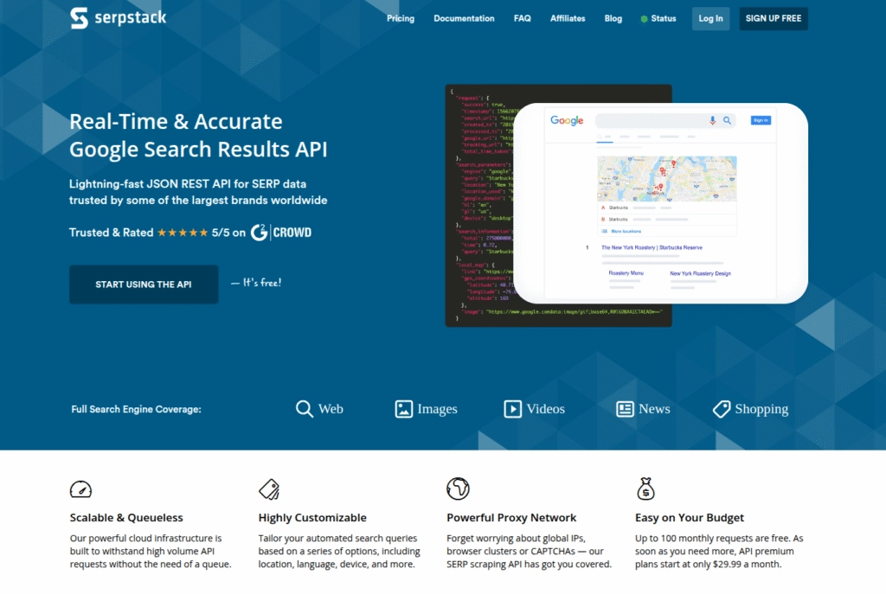
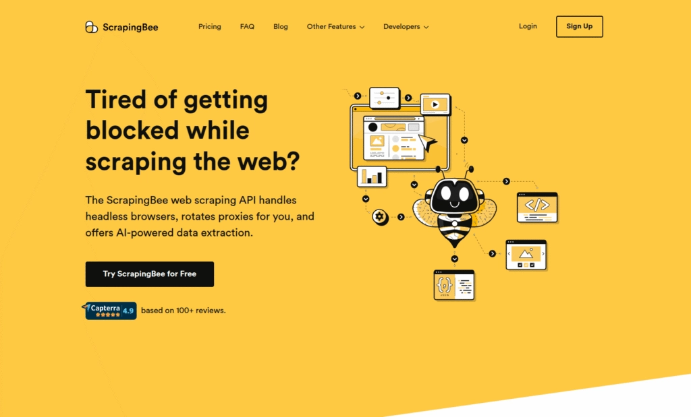
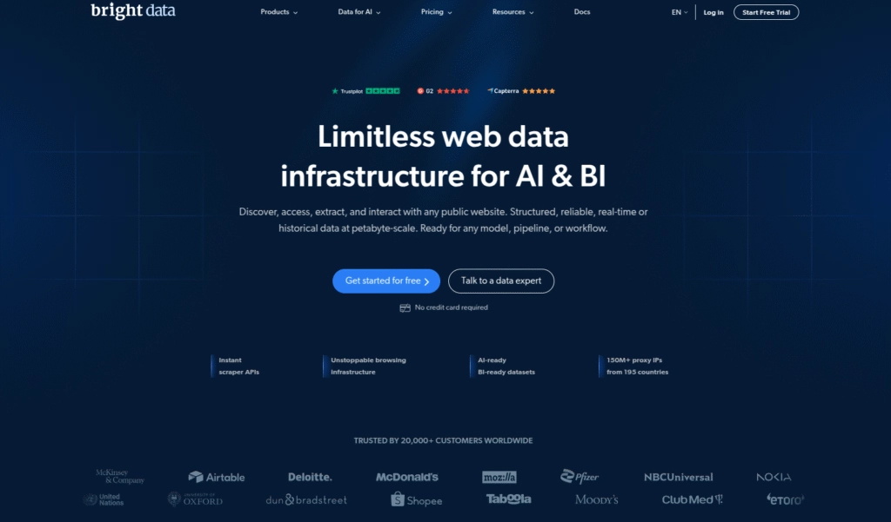
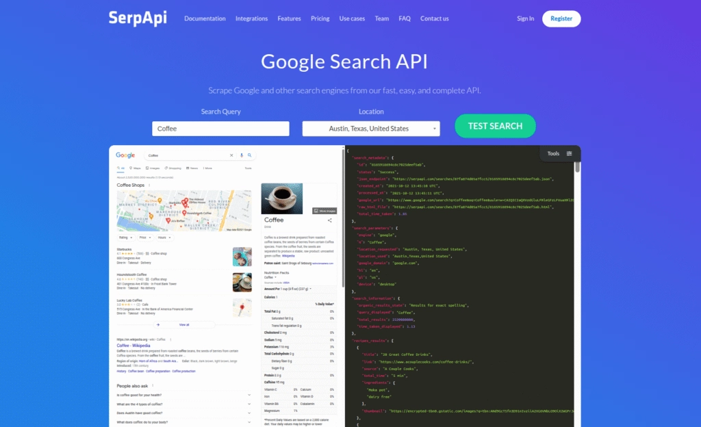
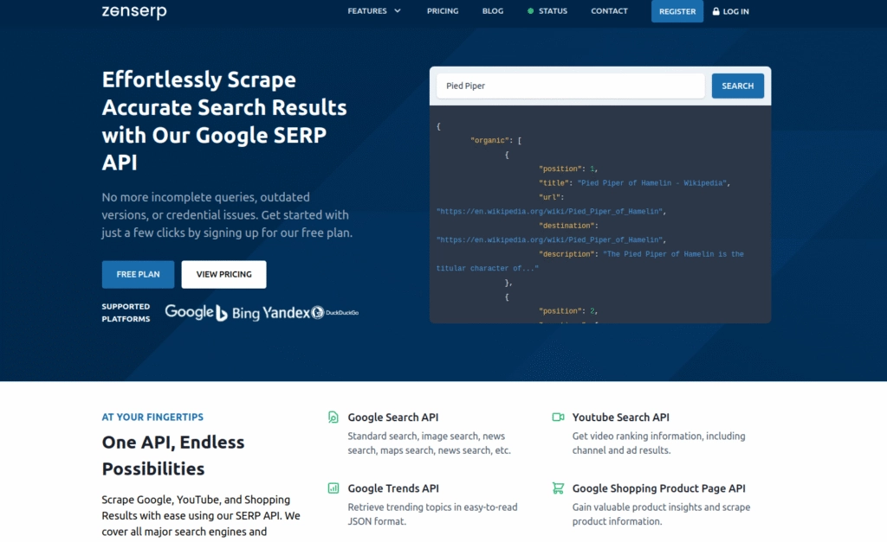
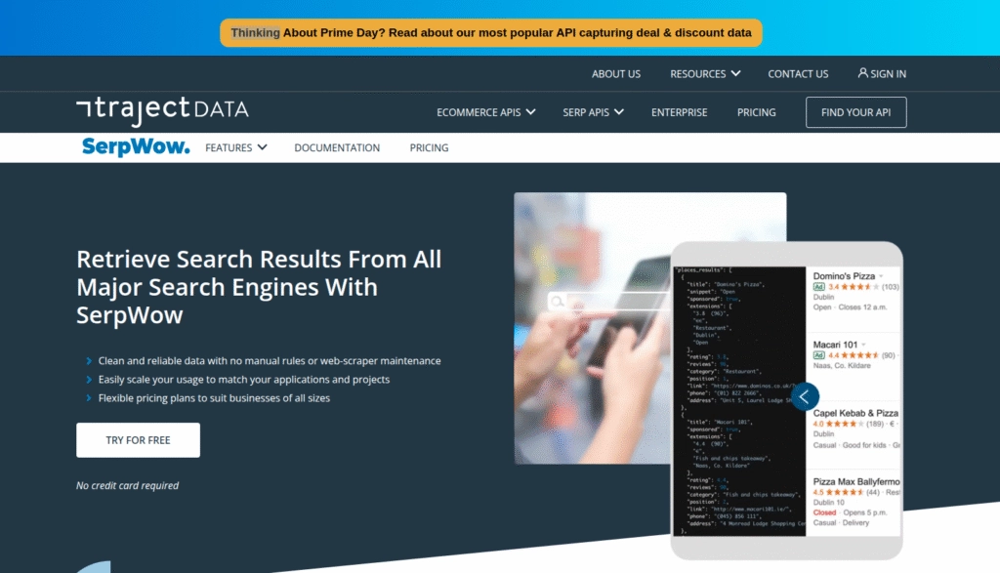

# Top 10 SERP API Providers That Actually Help You Track Rankings in 2025

You're putting in the SEO work, publishing content, optimizing pages—but where do you actually rank? If you're tired of manually checking Google every day or relying on outdated data, you're in the right place. Modern SEO pros use SERP APIs to pull real-time ranking data straight from search engines. No guesswork. No delays. Just clean, structured data you can act on.

This guide walks through 10 solid SERP API providers that handle everything from keyword tracking to local search monitoring. Whether you're managing client campaigns or keeping tabs on your own site, these tools take the manual labor out of rank tracking and give you the insights that actually matter.

---

## 1. SERPHouse

SERPHouse pulls real-time search results from Google without breaking your budget. It's built for people who need reliable data but don't want to pay enterprise prices. You get structured JSON responses with organic results, featured snippets, local packs, and ads—all through a simple API call.

What makes it stand out? The pricing. SERPHouse delivers the same core functionality as pricier competitors but keeps costs low enough for small teams and solo developers. It supports location-based searches and multiple languages, so you can track rankings in specific markets without extra hassle.

The setup is straightforward too. Clear documentation, fast response times, and multiple data formats make integration smooth. If you're just starting with SERP APIs or need a cost-effective solution that scales, SERPHouse checks the boxes without the bloat.

**What works:**
- Actually affordable compared to most alternatives
- Structured data from Google SERPs
- Covers organic results, ads, maps, snippets
- Location and language targeting included
- Free trial available

**What doesn't:**
- Mainly focused on Google
- Not ideal for JavaScript-heavy pages

---

## 2. Scrapingdog

Scrapingdog handles the annoying parts of scraping—CAPTCHAs, IP bans, bot detection—so you don't have to. It works with Google, Bing, and Yahoo, delivering clean search results through a single API endpoint. One call, and you get back structured data ready to use.

The tool takes care of proxy rotation and browser rendering behind the scenes. That means you can scrape JavaScript-heavy pages without extra configuration. It's built for both beginners who want something simple and developers who need reliable infrastructure for large-scale projects.

Response times are fast, and the JSON output is well-structured. Whether you're tracking keywords, analyzing competitors, or pulling metadata, Scrapingdog keeps things moving without getting in your way. 👉 [Get accurate SERP data without dealing with proxies or blocks](https://www.scraperapi.com/?fp_ref=coupons)

**What works:**
- Dedicated SERP API with high accuracy
- Easy integration with solid documentation
- Competitive pricing
- Structured JSON output
- Scrapes Google Maps and images too

**What doesn't:**
- Limited free requests in trial
- Some features locked behind paid plans
- No visual dashboard—API only

---

## 3. ScraperAPI

ScraperAPI removes the technical headaches from web scraping. It handles proxies, CAPTCHAs, and IP blocks automatically, so you can focus on getting the data instead of fighting with infrastructure. The service supports geotargeting, custom headers, and JavaScript rendering—useful when you're pulling data from dynamic search pages.

Built to scale, ScraperAPI manages millions of requests per month without breaking a sweat. That makes it a solid pick for larger operations that need consistent performance. You get organic results, featured snippets, ads, and local packs all formatted and ready to use.

The RESTful API and detailed documentation make setup relatively painless. You can simulate searches from different locations and devices, which helps when you're tracking rankings across markets. It's more technical than some alternatives, but the flexibility is worth it if you need control over how your data gets collected.

**What works:**
- Handles proxies, CAPTCHAs, and blocks automatically
- Scales well for high-volume extraction
- Supports geotargeting and custom headers
- Good for both small and large projects

**What doesn't:**
- No free plan—only limited trial
- Requires some technical setup
- No GUI dashboard

---

## 4. DataForSEO

DataForSEO gives you deep, detailed SERP data from Google, Bing, Yahoo, and more. It covers organic results, paid ads, local packs, knowledge panels—pretty much everything that shows up in search results. You can pull data by location, device, and language, making it useful for geo-targeted SEO tracking.

The platform goes beyond basic SERP scraping. You also get keyword research data, backlink analysis, and competitor monitoring all in one place. That makes it more of an all-in-one SEO data solution rather than just a rank tracker.

Usage-based pricing means you only pay for what you actually use, which can work in your favor depending on your needs. The documentation is thorough, and integration is straightforward for developers. It's a heavier tool compared to simpler options, but the depth of data justifies the complexity if you're running serious SEO operations.

**What works:**
- Accurate, comprehensive SERP data
- Multiple data types: organic, ads, local, more
- Location-based and language-specific tracking
- Pay-as-you-go pricing model

**What doesn't:**
- No free tier—pay-as-you-go only
- Can be complex for beginners
- Some APIs pricier than competitors
- Requires proper request structure

---

## 5. Serpstack

Serpstack delivers real-time Google search results with a focus on speed and reliability. The service pulls organic rankings, ads, featured snippets, and local results—all formatted as clean JSON. It's built to handle millions of API requests monthly with consistent uptime.

The tool supports custom location targeting and device simulation, so you can track how results differ across regions and platforms. That's particularly useful if you're managing SEO for multiple markets or want to see how mobile rankings compare to desktop.

Setup is simple thanks to clear documentation and a straightforward RESTful API. There's a free tier available for testing, which makes it easy to try before committing. If you need fast, reliable Google SERP data without extra complexity, Serpstack is worth considering.

**What works:**
- Real-time Google SERP data
- Fast with 99.9% uptime
- Location and device targeting
- Easy-to-use API with clear docs
- Free plan for testing

**What doesn't:**
- Google only—no Bing or Yahoo
- Advanced features behind paid plans
- Low monthly limit on free tier
- Requires basic coding knowledge

---

## 6. ScrapingBee

ScrapingBee handles the infrastructure so you can focus on collecting data. It automatically bypasses IP bans, CAPTCHAs, and browser detection, making it easier to scrape search results at scale. The service uses real browser sessions to handle JavaScript-heavy pages, which helps when standard scraping methods fall short.

You get organic results, featured snippets, ads, maps—everything you'd expect from a solid SERP API. The tool supports geolocation and device targeting, and it scales well for both small projects and large-scale data extraction.

The API is clean and well-documented, with support for multiple programming languages. If you're dealing with dynamic content or need a reliable way to scrape without getting blocked, ScrapingBee removes most of the friction. 👉 [Skip the scraping headaches and get clean SERP data delivered instantly](https://www.scraperapi.com/?fp_ref=coupons)

**What works:**
- Bypasses CAPTCHAs and IP bans automatically
- Scrapes Google SERPs with rich result extraction
- Geolocation and device targeting
- Scales for small and large projects

**What doesn't:**
- Mainly Google—limited engine support
- No free tier—only trial credits
- May require technical skills for advanced use
- Costs increase with high volume or JavaScript rendering

---

## 7. Bright Data

Bright Data (formerly Luminati) is built for enterprise-level scraping. It offers massive proxy infrastructure, global coverage, and advanced customization options for pulling SERP data at scale. The service handles CAPTCHA solving, IP rotation, and bot detection automatically, so you can run large scraping operations without interruptions.

You get structured search results with support for location, language, browser type, and device view. The platform includes SDKs and no-code tools alongside detailed documentation, making it accessible despite its enterprise focus.

This tool is powerful but comes with a price tag to match. If you're running serious data operations or building a SaaS platform that relies on search data, Bright Data delivers reliability and scale. For smaller projects, it might be more than you need.

**What works:**
- Structured search engine results
- Bypasses CAPTCHAs, blocks, IP bans
- Browser rendering and JavaScript support
- Excellent docs, SDKs, and support
- Highly scalable for enterprises

**What doesn't:**
- High pricing—enterprise-level budgets
- Overkill for small businesses or simple tasks
- Requires technical understanding
- No free tier—only trial or demo

---

## 8. SerpAPI

SerpAPI covers more search engines than most alternatives—Google, Bing, Yahoo, Baidu, and more—all accessible through one unified API. It pulls detailed SERP elements including organic results, paid ads, featured snippets, Google Maps, Shopping results, news, videos, and images.

The tool supports real-time geotargeting, language selection, and device-specific results. That breadth of data makes it useful if you're tracking rankings across multiple platforms or need insights beyond Google.

SerpAPI takes a developer-first approach with interactive documentation, client libraries in multiple languages, and a playground for testing requests. It's trusted by both startups and enterprises, though the pricing leans toward the higher end. If you need comprehensive search data across platforms, SerpAPI delivers.

**What works:**
- Extracts detailed SERP elements across engines
- Geolocation and device targeting
- Scalable for high-volume tasks
- Trusted by startups and enterprises

**What doesn't:**
- Premium pricing—can be expensive
- No free tier—only trial credits
- May offer more data than needed for basic use
- Slight learning curve for full features

---

## 9. Zenserp

Zenserp pulls structured search data from Google, Bing, and DuckDuckGo. It handles IP blocks, CAPTCHA solving, and proxy rotation behind the scenes, so you get clean results without dealing with scraping barriers. The tool covers organic results, ads, images, videos, shopping, and news.

Location-based targeting lets you track rankings in specific markets, which helps with local SEO and competitor analysis. The API is developer-friendly with clear documentation and straightforward integration. There's both a free plan and paid options, making it easy to test and scale as needed.

Zenserp works well for small startups, SEO agencies, and larger teams alike. The pricing is fair, and the service is reliable. If you're looking for a solid SERP API without unnecessary complexity, this one fits the bill.

**What works:**
- Real-time Google and Bing SERP data
- Covers organic, images, videos, ads, news, shopping
- Free plan with limited use
- Scales from small to large needs

**What doesn't:**
- Limited to a few search engines
- Low monthly limit on free tier
- No built-in dashboard for analytics

---

## 10. Serpwow

Serpwow returns real-time Google search results in structured JSON format. It pulls organic results, sponsored ads, featured snippets, local packs, videos, images—everything you'd expect from a complete SERP API. The service supports global searches, letting you simulate queries from any country, language, or device.

The tool is built with developers in mind. You get detailed documentation, code examples in multiple languages, and a dashboard for tracking API usage. Pricing is flexible with a free trial available, making it accessible for solo developers, agencies, and businesses.

Serpwow focuses on Google, which means it doesn't cover other search engines. But if Google is your main concern and you want reliable, location-specific data, it handles that well without overcomplicating things.

**What works:**
- Real-time Google SERP data in JSON
- Global location and device targeting
- Clean API with great documentation
- Multiple SDKs and code samples

**What doesn't:**
- Google only—no Bing, Yahoo, or others
- No free tier—only temporary trial
- May not suit high-frequency, large-scale scraping on lower plans

---

## Final Thoughts

SEO moves fast, and having access to accurate, real-time search data keeps you ahead instead of guessing. The tools on this list cover different needs—some prioritize speed, others offer advanced features, and a few like SERPHouse focus on delivering real value without inflating costs.

Pick the provider that matches your workflow, your budget, and the scale you're working at. Whether you're tracking a handful of keywords or managing data for hundreds of clients, one of these SERP APIs will give you the ranking insights you need to make smarter decisions.
